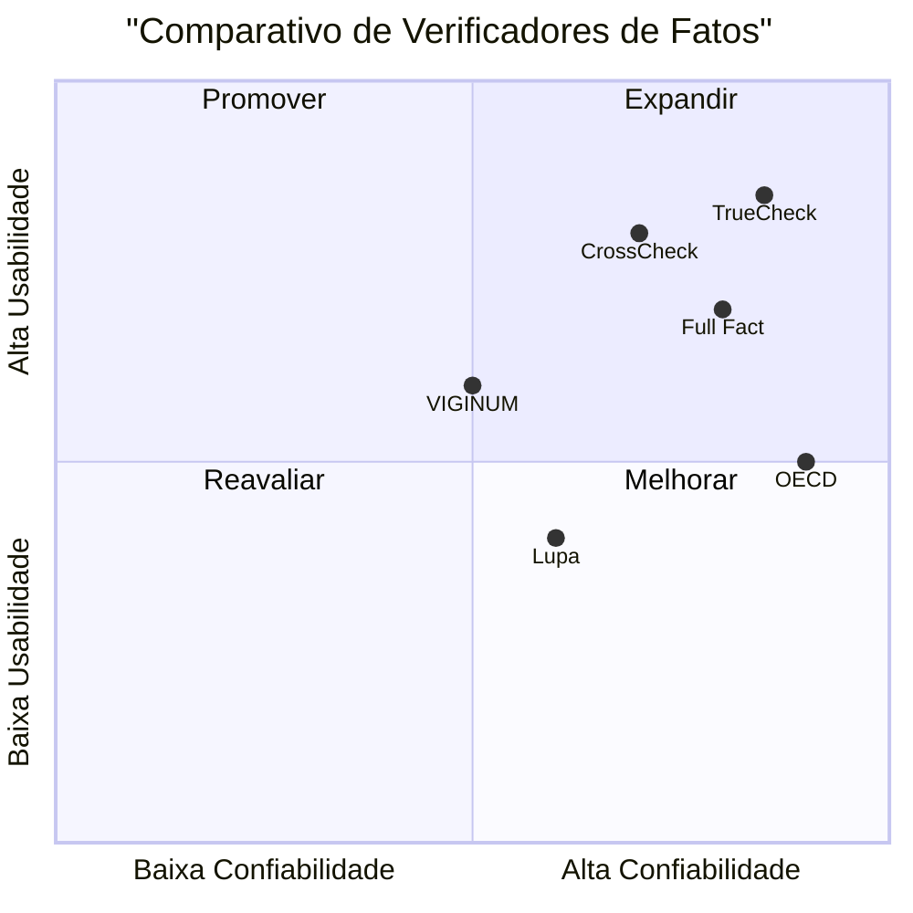

# Documento de Requisitos do Produto (PRD) para o TrueCheck

## Informações do Projeto
- **Linguagem**: Português
- **Linguagem de Programação**: React, JavaScript, Tailwind CSS
- **Nome do Projeto**: true_check

## Definição do Produto
### Objetivos do Produto
1. Combater a desinformação fornecendo uma ferramenta de verificação rápida e confiável.
2. Promover a educação midiática, ensinando práticas seguras de consumo de informação digital.
3. Fornecer uma análise objetiva e baseada em fontes confiáveis.

### Histórias de Usuário
1. Como um usuário, quero inserir um link ou imagem para verificar a credibilidade de uma notícia, para que eu possa evitar a disseminação de informações falsas.
2. Como um usuário, quero ver uma análise detalhada da veracidade do conteúdo, para que eu possa entender por que uma notícia é considerada verdadeira ou falsa.
3. Como um jornalista, quero uma ferramenta rápida para verificar fatos, para que eu possa garantir a precisão das minhas reportagens.

### Análise Competitiva
1. **Lupa**
   - **Prós**: Amplo banco de dados de verificações.
   - **Contras**: Interface pouco intuitiva.
2. **Full Fact**
   - **Prós**: Análise detalhada e transparente.
   - **Contras**: Foco principalmente no Reino Unido.
3. **VIGINUM**
   - **Prós**: Especializado em desinformação digital.
   - **Contras**: Limitações geográficas.
4. **OECD**
   - **Prós**: Dados confiáveis e atualizados.
   - **Contras**: Foco em dados econômicos.
5. **CrossCheck**
   - **Prós**: Colaboração internacional.
   - **Contras**: Processo de verificação lento.

### Gráfico Quadrante Competitivo

## Especificações Técnicas
### Análise de Requisitos
- **Requisitos Funcionais**: Verificação automática de fatos, análise contextual e semântica, classificação de credibilidade.
- **Requisitos Não Funcionais**: Interface minimalista e intuitiva, design responsivo, feedback visual imediato.

### Pool de Requisitos
- **P0**: Verificação automática de fatos, interface intuitiva.
- **P1**: Análise contextual e semântica, design responsivo.
- **P2**: Classificação de credibilidade, feedback visual imediato.

### Rascunho de Design de UI
- **Tela de Entrada**: Logo do TrueCheck, campo de entrada para link ou imagem, botão de checagem.
- **Tela de Análise**: Sidebar esquerda com informações da fonte, área central com linha do tempo de verificação, sidebar direita com insights e termômetro de veracidade.
- **Tela de Resultado**: Resumo da análise, pontuação final de credibilidade, sugestões educativas.

### Perguntas Abertas
1. Como garantir a precisão da análise semântica?
2. Quais são as melhores práticas para a integração com bases de dados de verificadores de fatos?
3. Como otimizar o feedback visual para diferentes tipos de usuários?
